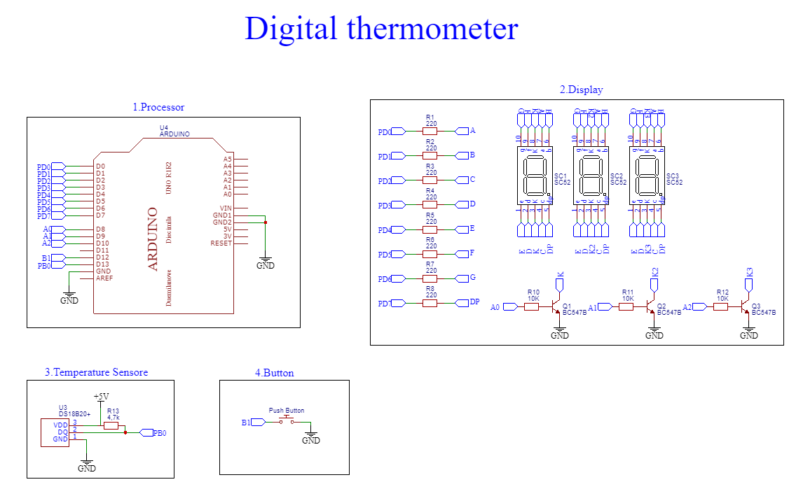

# Simple 7-segment display thermometer 
Simple 7-segment display thermometer project  based on Arduino
## Description 
The device is measures
 temperature by DS1820B sensor and display it on 7-segment display in Celcius or Fahrenheit units.
 ## Schematic 
 
 ## Components 
 

 - Arduino Uno
 - DS1820B
 - 4x7 segment common cathode display
 - 4x bipolar NPN transistor
 -  8x 220R resistors
 
